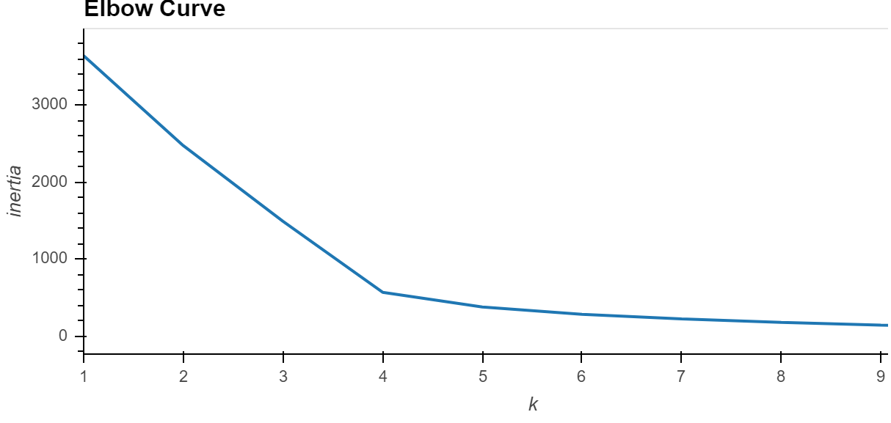
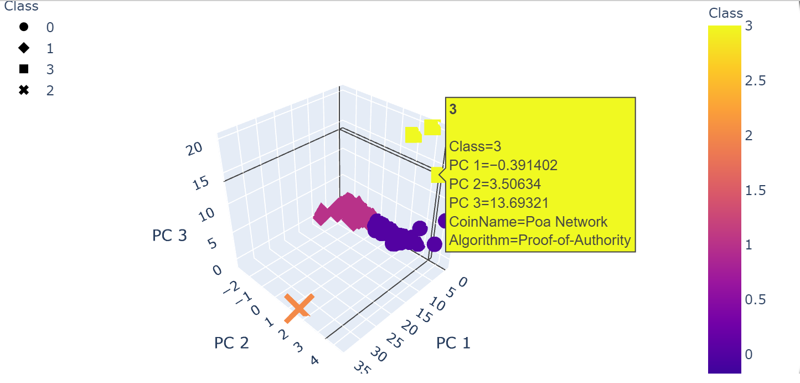
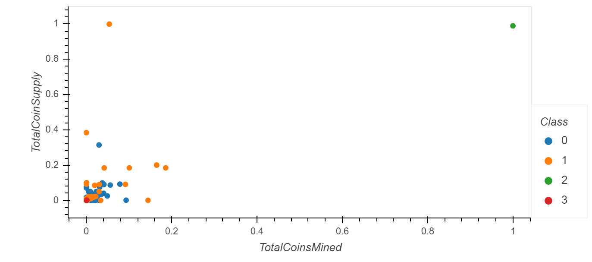

# Cryptocurrencies
## Overview and Purpose
The purpose of this analysis is to support our investment banking client who is interested in starting a cryptocurrency investment portfolio. This is a fairly new subject with a lot of cryptocurrency options to choose from and to understand. This analysis supports our client by using unsupervised machine learning to investigate those options.

## Data and Environment
The data used for this analysis consists of 1253 Rows, including the header row, with the following 7 column:
    * index based on coin name
    * CoinName
    * Algorithm
    * IsTrading
    * ProofType
    * TotalCoinsMined
    * TotalCoinSupply
The data set is available for viewing here (https://github.com/davidmcbee/Cryptocurrencies/blob/main/Resources/crypto_data.csv)

The environment used:
Jupyter Notebook
The tools used: Python, Pandas, Plotly express, sklearn preprocessing, StandadScaler, MinMaxScaler, decomposition and cluster KMeans; hvplot

## Steps and Results
The steps involved:
1. Cleaning the data to prepare it so that the Machine Learning can take place efficiently.
2. Fitting, training  and making predictions from the data.

   ### Cleaning the Data
   After reading in the data set the following cleaning steps were taken:
   1. Keep all the cryptocurrencies that are being traded.
   2. Keep all the cryptocurrencies that have a working algorithm.
   3. Remove the "IsTrading" column.
   4. Remove rows that have at least 1 null value.
   5. Keep the rows where coins are mined.
   6. Split out the CoinName to another dataframe.
   7. Drop CoinName from the original data frame.
   8. Use get_dummies to create variables for text features.
   9. Standardize the data with StandardScaler
   10. Reduce the data dimensions to 3 using Principal Component Analysis (PCA)
   After conducting the above steps we end up with 3 columns of scaled PCA data along with TotalCoinSupply, TotalCoinsMined and ProofType
   ### Fitting and Training
   The next steps are:
   1. Create a Elbow Curve Chart to understand how many components should be used. See figure 1.

Figure 1.

2.  Next we create the KMeans model using the 4 clusters based on the Elbow Curve.
3.  Next we use the model to make predictions.
4.  Put the prediction results, Class, the original data frame, CoinsMined, CoinSupply, ProofType, the CoinName data frame into one data frame.
5.  Create a 3d scatter plot from the data. See figure 2

Figure 2.
6. Create a table of the tradable cryptocurrencies along with the prediction classes. this is so follow on analysis can be done. There are 532 tradable cryptocurrencies.
7.  Next, TotalCoinSupply and TotalCoinsMined were scaled so that a non-skewed graph could be created. See Figure 3.

Figure 3.
## Summary
From the scatter plot one can see there are 2 main outliers and the main clusters are less than .4 TotalCoinSupply and less then .2 Total CoinsMined. Based on this and looking at the 3d plot, figure2, some follow on investigation is warranted to understand why class 3 coins and algorithms are different from class 0, 1 and2. Additionally, why is class 2 (the orange cross) different from the other classes.
